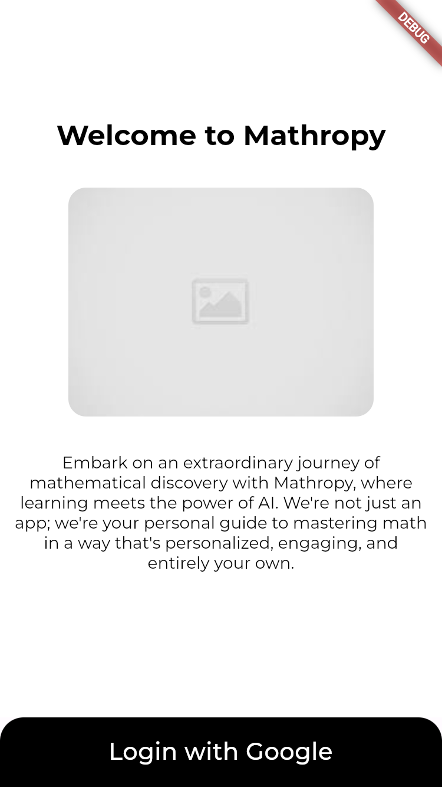
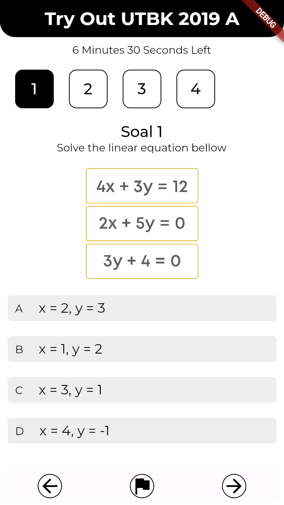
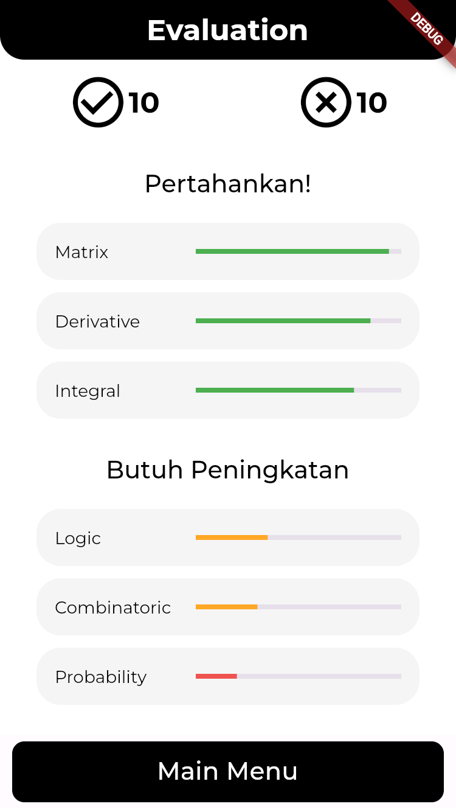

GDSC HackFest 2024
# Member

- Eryawan Presma Yulianrifat (Hacker)
- Belati Jagad Bintang Syuhada (Hipster)
- Oey Joshua Jodrian (Hipster)
- Ghana Ahmada Yudistira (Hacker)

# Description

An educational platform for high school students focus on mathematics. Functioning as an interactive personal tutor that provides comprehensive explanations of mathematical concepts using Large Language Model (LLM) technology. The tutoring system will be configured to consistently recommend lessons necessary for further understanding based on the results of quizzes or exams previously completed. The application's interface will be designed so that users can only request comprehensive explanations, and the system will not provide direct answers to user queries. Through this limitation, the utility of LLM in this case can be redirected from being a key answer provider to a personal tutor capable of explaining concepts comprehensively.

# Screenshot
 
Login Page, tryout question and evaluation page respectively. 

# Todo
- [ ] Implement Backend
- [ ] Prompt Engineering
- [ ] Finishing Frontend
- [ ] Deployment